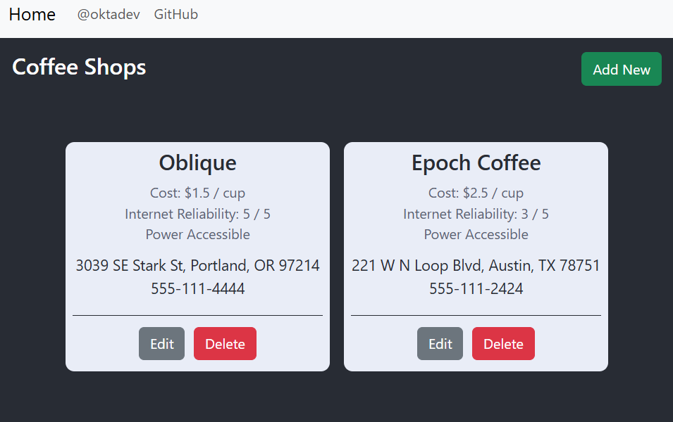

# Springboot - ReactSs application built using an external template

The web application manages a list of coffee shops.



It is built with JeKa by using an external KBean containing the build logic.
This allows to decribe the whole build only by specifying the following properties :

jeka.properties
``` 
jeka.version=0.11.0-beta.0
jeka.java.version=21

jeka.inject.classpath=dev.jeka:template-examples:0.11.0-alpha.7.1
jeka.default.kbean=dev.jeka.demo.templates.SpringBootTemplateBuild

@springBootTemplateBuild.appId=demo-templates-coffeeshop
@springBootTemplateBuild.nodeJsVersion=20.14.0
```

Let's see how to use it.

## Setup IDE

```shell
jeka intellij: iml
```

## Build

This springboot project is built using [JeKa](https://jeka.dev) with this [build template](https://github.com/jeka-dev/demo-build-templates/blob/master/src/dev/jeka/demo/templates/SpringBootTemplateBuild.java)

Help on template KBean :
```shell
jeka --doc
```

To create a bootable jar, containing the client app, and execute SonarQube analysis on both java and js, execute :
```shell
jeka pack
```

Same but passing by sonarqube quality checks, execute :
```shell
jeka packQuality
```

To run the bootable jar built in previous step, execute :
```shell
jeka runJar
```


## Purpose

This project showcases, how we can easily re-use build definition across several projects.

Here, we reuse a KBean which holds methods and parameters for building and delivering the project. 
We can access to this KBean sources just by click on the class name when using IntelliJ.

This KBean is designed to build Spring-Boot project, optionally containing a ReactJs nodejs project.

This includes tests with coverage, Sonarqube analysis, ReactJs packaging (if present) and bootable jar creation.

This project needs to define only what is specific  (dependencies, and Java version),
The `appId` and `nodeJsVersion` can be optionally overrides defaults.


